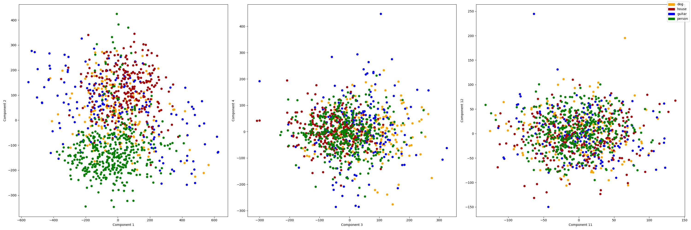
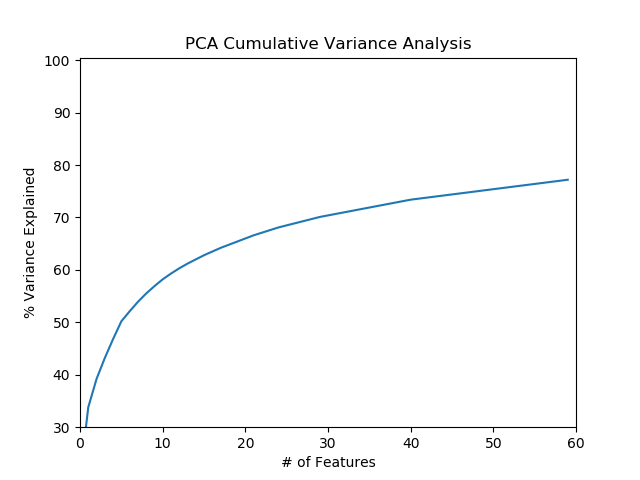
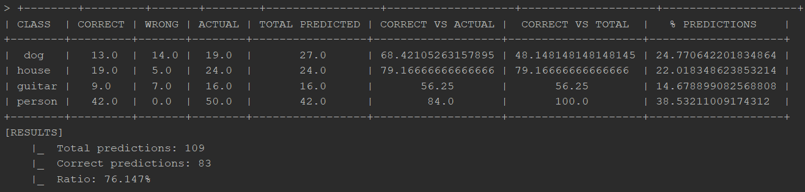
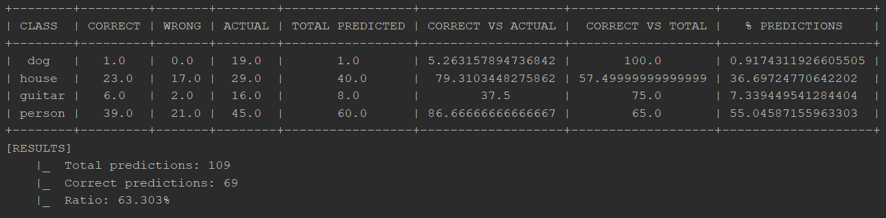
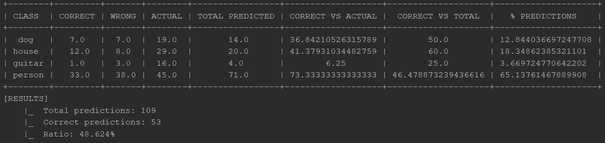
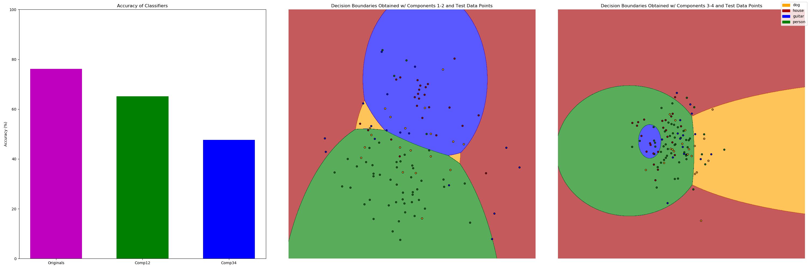
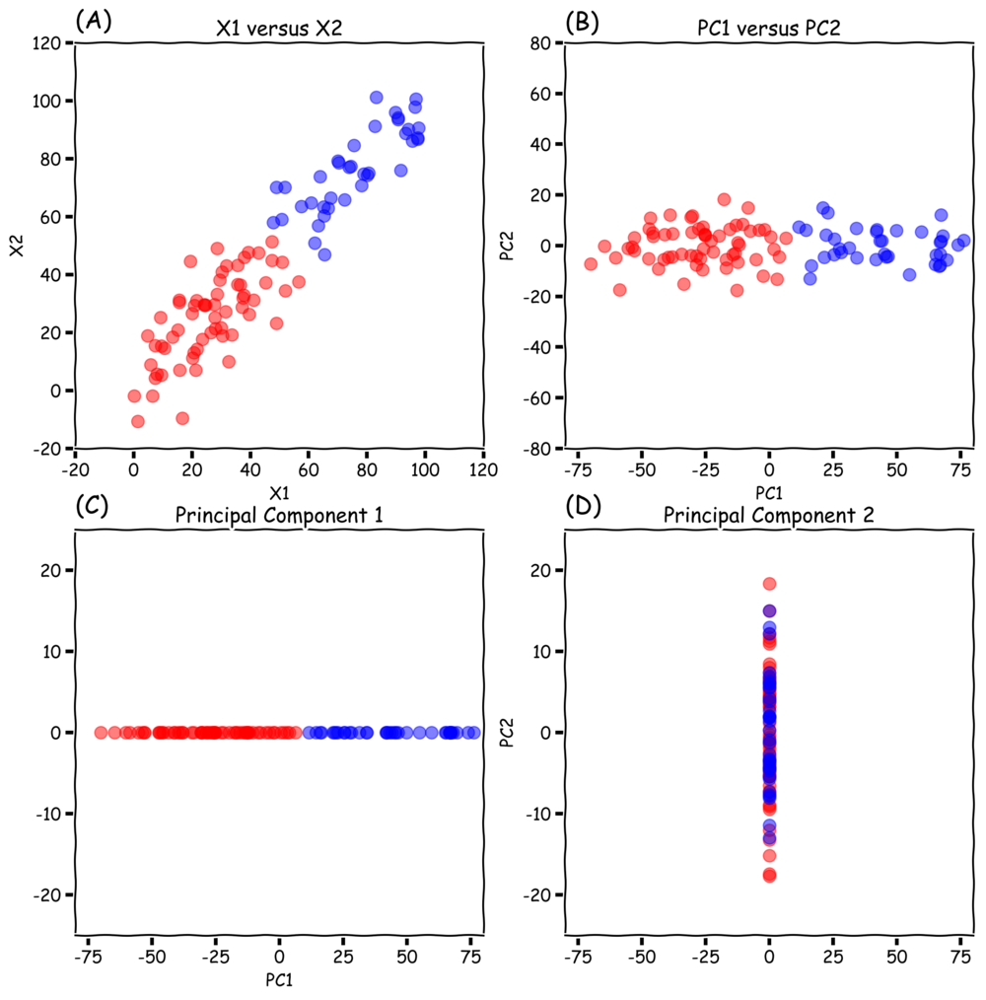
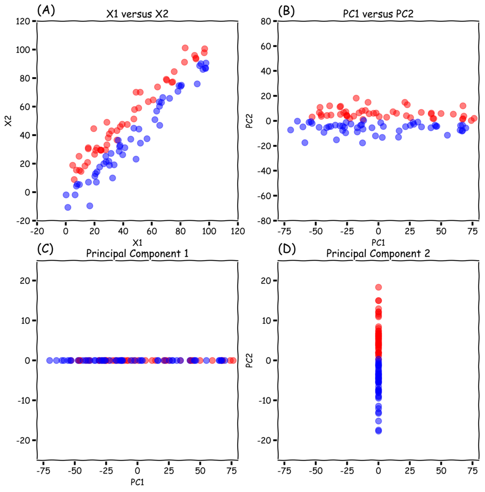

# Homework 1 - Write Up

## Introduction

During the development of this homework, after several trials and runs I have preferred to move towards a more interactive program which allows the user to make multiple choices: the reason has been that, from time to time, the necessity of visualizing several different image reconstructions, being able to select them on-line without needing to run again the whole program (which is constly since it means to perform each time new Principal Component Analysis (PCA)) has shown up, therefore the menu-choice configuration was chosen.

The program is still very rough in its core functioning and implementing (e.g global variables were used for simplicity), however it seemed comfortable to use to me, thus I decided to keep such a configuration.

## Into the code

### Initialization

The following pieces of code are the steps needed to install the modules used inside the final script plus the imports and the definitions of the global variables used.


```python
!pip3 install matplotlib
!pip3 install numpy
!pip3 install sklearn
!pip3 install pillow
!pip3 install prettytable
```


```python
%matplotlib inline
import sys
import matplotlib.pyplot as plt
import matplotlib.patches as mpatches
import matplotlib.colors as mcolors
from sklearn import preprocessing
from sklearn.decomposition import PCA
from sklearn.naive_bayes import GaussianNB
import sklearn.model_selection as model
import numpy
from PIL import Image
import os
from prettytable import PrettyTable
#from mlxtend import plotting


verbose = False
### GLOBALS ###
X = []
labels = []
colors_dict = {"dog": "orange", "house": "#A50104", "guitar": "blue", "person": "green"}
handles = []
colors = []
index = 0
mi = 0
stdDev = 0
wm = True
ws = True
nComp1 = 60
nComp2 = 6
nComp3 = 2
nCompLast = 6
firstPCAdone = False
components_backup = []
fig
```

### Some utility functions

The following is a collection of functions which are not strictly related to the PCA, but were useful for visualizing the images' reconstructions, the scatter plots and the cumulative explained variance.
<br>
An other function is the <code>SetNComp</code> one, which allows to specify the number of components to use for each of the 4 PCAs performed later on.<br>
Finally, the <code>printMenu</code> and the <code>savePCsImages</code> functions do exactly what their names say: print the interactive menu and save the PCs reconstructed images.


```python
def printScatters():
    """ Displays Projected Data Scatter Plot """
    global X_proj
    scats = plt.figure(figsize=(30, 10))
    ax = scats.add_subplot(131)
    ax.scatter(X_proj[:, 0], X_proj[:, 1], c=colors)
    ax.set_xlabel("Component 1")
    ax.set_ylabel("Component 2")

    ax = scats.add_subplot(132)
    ax.scatter(X_proj[:, 2], X_proj[:, 3], c=colors)
    ax.set_xlabel("Component 3")
    ax.set_ylabel("Component 4")

    ax = scats.add_subplot(133)
    ax.scatter(X_proj[:, 10], X_proj[:, 11], c=colors)
    ax.set_xlabel("Component 11")
    ax.set_ylabel("Component 12")

    scats.legend(handles=handles)

    scats.show()
    #scats.savefig("scatterplots.png")

def displayImageReconstruction():
    """This function allows to select an image by inserting its number 
    (index in the dataset) and print its reconstruction w.r.t. each PCA performed previously
    so to compare the results"""
    global fig
    imgIndex = int(input("Which image to reconstruct? > "))

    # Printing out reconstruction
    fig = plt.figure(figsize=(50, 10))

    ax = fig.add_subplot(151)
    ax.axis('off')
    ax.imshow(numpy.reshape(X[imgIndex], (227, 227, 3)))
    ax.set_title("Original image")

    ax = fig.add_subplot(152)
    ax.imshow(numpy.reshape(X_inv1[imgIndex, :]/255.0, (227, 227, 3)))
    ax.axis('off')
    ax.set_title(str(nComp1) + " PCs")

    ax = fig.add_subplot(153)
    ax.imshow(numpy.reshape(X_inv2[imgIndex, :]/255.0, (227, 227, 3)))
    ax.axis('off')
    ax.set_title(str(nComp2) + " PCs")

    ax = fig.add_subplot(154)
    ax.imshow(numpy.reshape(X_inv3[imgIndex, :]/255.0, (227, 227, 3)))
    ax.axis('off')
    ax.set_title(str(nComp3) + " PCs")

    ax = fig.add_subplot(155)
    ax.imshow(numpy.reshape(X_invLast[imgIndex, :]/255.0, (227, 227, 3)))
    ax.axis('off')
    ax.set_title("Last " + str(nCompLast) + " PCs")

    fig.show()
    print("\nDone!\n")

def savePCsImages(name="PCsDifferences.png"):
    """simply saves figure with a given name"""
    global fig
    fig.savefig(name)

def printCumVariance():
    """Prints the cumulative variance, it's a little buggy (in some cases it overlaps to the last plotted figure)
    but if used before others it should be fine"""
    var = numpy.cumsum(numpy.round(pca.explained_variance_ratio_, 3) * 100)
    plt.ylabel('% Variance Explained')
    plt.xlabel('# of Features')
    plt.title('PCA Cumulative Variance Analysis')
    plt.xlim(0, 60)
    plt.ylim(30, 100.5)
    plt.style.context('seaborn-whitegrid')
    plt.plot(var)
    plt.show()
    #plt.savefig("CumulativeVariance.png")

def setNComp():
    """
    Allows to ovverride the default settings and decide number of components for each of the 4 PCAs.
    It also allows you to decide whether to use mean and std. dev. for standardization.
    """
    global nComp1
    global nComp2
    global nComp3
    global nCompLast
    global wm
    global ws
    nComp1 = int(input(f"N. of Components for first PCA  >\t"))
    nComp2 = int(input(f"N. of Components for second PCA  >\t"))
    nComp3 = int(input(f"N. of Components for third PCA  >\t"))
    nCompLast = int(input(f"N. of Last Components for fourth PCA  > "))
    c = input("With mean? y/n > ").lower()
    if c == "y" :
        wm = True
    else :
        wm = False
    c = input("With stdDev? y/n > ").lower()
    if c == "y" :
        ws = True
    else :
        ws = False

    print("\nDone!\n")

def printMenu():
    print("Select one of the following options [be aware that options 3,4,5 and 6 require option 1 to be run first]:"
          "\n\t1. Perform PCA"
          "\n\t2. Set number of components and standardization"
          "\n\t3. Display Cumulative Variance"
          "\n\t4. Save PCA Image Reconstructions"
          "\n\t5. Print Scatter Plot"
          "\n\t6. Print Image Reconstruction"
          "\n\t7. Run Gaussian Naive-Bayes Classifier"
          "\n\t8. Exit")

```

### Principal Component Analysis and Classification

Here follow the two core functions or the program: <code>performPCA</code> and <code>classify</code>.
They will be briefly explained.

#### performPCA

The first thing done in this function, after calling the global variables, is a check on whether it is the first time the function is being called or not. The reason behind this is that the program performs the PCA on all the components, no matter how many of them were chosen, because one of the requirements was to select the **last N (6) components** and in order to do so all the previous ones were to be found as well. 
<br>
Since the best components can be retrieved from the result of the whole components matrix through a simple slice, this turns out to be a big improvement in performance when multiple PCAs are to be performed on different numbers of components.
<br><br>
Moreover, a further improvement is given by the fact that the projection of the dataset on the whole components (<code>X_proj</code>) is performed only the first time: whenever the function is called again with any other number of components <code>X_proj</code> is used to extract the projections on such components only, the <code>pca.components_</code> matrix is substituted with the previously extracted components and the only actual **dot product** operation that needs to be performed is the <code>pca.inverse_transform</code> one.
<br><br>
Finally, some commented lines of code were left inside the function: they are different methods of implementing the same process that were exploited during the development of the program, however they turned out to be less performing.


```python
def performPca():
    """ Performs PCA on 4 different number of PCs and displays the reconstructed images VS the original one"""
    global pca
    #global pca1
    #global pca2
    #global pca3
    global X_proj
    global fig
    global X_invLast
    global X_inv1
    global X_inv2
    global X_inv3
    global firstPCAdone
    global components_backup


    #pca1 = PCA(nComp1)
    #pca2 = PCA(nComp2)
    #pca3 = PCA(nComp3)

    if not firstPCAdone:
        pca = PCA()
        scaled = preprocessing.scale(X, with_mean=wm, with_std=ws)
        pca.fit(scaled)
        print("[OK] PCA fitting")
        components_backup = pca.components_
        compLast = components_backup[-nCompLast:]
        comp1 = components_backup[:nComp1]
        comp2 = components_backup[:nComp2]
        comp3 = components_backup[:nComp3]
        print("[OK] Components Extracted")
        X_proj = pca.transform(scaled)
        print("[OK] PCA transform on scaled data")
        firstPCAdone = True
    else:
        compLast = components_backup[-nCompLast:]
        comp1 = components_backup[:nComp1]
        comp2 = components_backup[:nComp2]
        comp3 = components_backup[:nComp3]
        print("[OK] Components Extracted")

    """ # METHOD 1
    pca.components_ = compLast
    X_projLast = pca.transform(scaled)
    X_invLast = pca.inverse_transform(X_projLast)*stdDev+mi
    print("[OK] PCA last",nCompLast)
    
    pca.components_ = comp1
    X_proj1 = pca.transform(scaled)
    X_inv1 = pca.inverse_transform(X_proj1)*stdDev+mi
    print("[OK] PCA",nComp1)

    pca.components_ = comp2
    X_proj2 = pca.transform(scaled)
    X_inv2 = pca.inverse_transform(X_proj2)*stdDev+mi
    print("[OK] PCA",nComp2)

    pca.components_ = comp3
    X_proj3 = pca.transform(scaled)
    X_inv3 = pca.inverse_transform(X_proj3)*stdDev+mi
    print("[OK] PCA",nComp3)
    """

    """ "# METHOD 2
    pca.components_ = compLast
    X_projLast = pca.transform(scaled)
    X_invLast = pca.inverse_transform(X_projLast)*stdDev+mi
    print("[OK] PCA last",nCompLast)
    
    X_proj1 = pca1.fit_transform(scaled)
    X_inv1 = pca1.inverse_transform(X_proj1)*stdDev+mi
    print("[OK] PCA",nComp1)

    X_proj2 = pca2.fit_transform(scaled)
    X_inv2 = pca2.inverse_transform(X_proj2)*stdDev+mi
    print("[OK] PCA",nComp2)

    X_proj3 = pca3.fit_transform(scaled)
    X_inv3 = pca3.inverse_transform(X_proj3)*stdDev+mi
    print("[OK] PCA",nComp3)
    """

    # METHOD 3 --- improvement: save transposed version of X_proj

    print("[PCA] performing Projected Matrix transposition and selection")
    tmp = numpy.transpose(X_proj)[:nComp1]
    X_proj1 = numpy.transpose(tmp)
    print("[PCA] done")
    pca.components_ = comp1
    X_inv1 = pca.inverse_transform(X_proj1)*stdDev+mi
    print("[OK] PCA",nComp1)


    print("[PCA] performing Projected Matrix transposition and selection")
    tmp = numpy.transpose(X_proj)[:nComp2]
    X_proj2 = numpy.transpose(tmp)
    print("[PCA] done")
    pca.components_ = comp2
    X_inv2 = pca.inverse_transform(X_proj2) * stdDev + mi
    print("[OK] PCA", nComp2)


    print("[PCA] performing Projected Matrix transposition and selection")
    tmp = numpy.transpose(X_proj)[:nComp3]
    X_proj3 = numpy.transpose(tmp)
    print("[PCA] done")
    pca.components_ = comp3
    X_inv3 = pca.inverse_transform(X_proj3) * stdDev + mi
    print("[OK] PCA", nComp3)


    print("[PCA] performing Projected Matrix transposition and selection")
    tmp = numpy.transpose(X_proj)[-nCompLast:]
    X_projLast = numpy.transpose(tmp)
    print("[PCA] done")
    pca.components_ = compLast
    X_invLast = pca.inverse_transform(X_projLast) * stdDev + mi
    print("[OK] PCA Last", nCompLast)

    print("\nDone!\n")
    return
```

#### classify
The <code>classify</code> function performs principal component analysis on the first 4 PCs and then uses a **Gaussian Naivë-Bayes classifier** on the projected data which has the following formulation:
<br><br>


<br><br>
The function carries out two experiments: the first one considering components 1 and 2, the second one components 3 and 4.
<br>
Finally, the results of the experiments are shown both graphically, by plotting the **decision boundaries** of the classifier hovered by the scattered plot of the projected test sets, and as text, inside tables printed using the <code>prettytable</code> module (for a better visualization).


```python
def classify():
    print("GaussianNB classifier started")
    if verbose: print("[INFO] Splitting Training Set from Test Set")
    X_train, X_test, Y_train, Y_test = model.train_test_split(X, labels, test_size=0.1)
    #nComponents = int(input("[DONE] Splitting\n[INPUT] N. of Components to use for pca? "))
    #pca = PCA(nComponents)
    pca = PCA(4)
    if verbose: print("[INFO] Performing PCA fit for", 4,"components")
    pca.fit(X_train)
    if verbose: print("[DONE] Fitting\n[INFO] Performing dimensionality reduction on train and test sets")

    X_train_proj = pca.transform(X_train)
    tmp12 = numpy.transpose(X_train_proj)[:2]
    tmp34 = numpy.transpose(X_train_proj)[2:]
    X_train_proj12 = numpy.transpose(tmp12)
    X_train_proj34 = numpy.transpose(tmp34)

    X_test_proj = pca.transform(X_test)
    tmp12 = numpy.transpose(X_test_proj)[:2]
    tmp34 = numpy.transpose(X_test_proj)[2:]
    X_test_proj12 = numpy.transpose(tmp12)
    X_test_proj34 = numpy.transpose(tmp34)

    if verbose: print("[DONE] Dim. reduction")

    #Experiment 0

    print("\n#########################################\n"
          "#### EXPERIMENT 0 - Original Features ###\n"
          "#########################################\n")
    if verbose: print("[INFO] Fitting Gaussian Naive-Bayes Classifier")
    gnb = GaussianNB()
    gnb.fit(X_train, Y_train)
    score_o = gnb.score(X_test, Y_test) * 100
    if verbose: print("[DONE] Fitting")  # \n[INFO] Predicted Labels Accuracy: {:.3f}%".format(score12))
    if verbose: print("[INFO] Predicting labels for test set...")
    prediction = gnb.predict(X_test)
    i = 0
    correct = 0
    T = PrettyTable()
    T.field_names = ["PREDICTED", "ACTUAL", "RESULT"]
    CT = PrettyTable()
    CT.field_names = ["CLASS", "CORRECT", "WRONG", "ACTUAL", "TOTAL PREDICTED", "CORRECT VS ACTUAL", "CORRECT VS TOTAL",
                      "% PREDICTIONS"]
    labels_stats = {"dog": [0, 0, 0, 0, 0, 0, 0], "house": [0, 0, 0, 0, 0, 0, 0], "guitar": [0, 0, 0, 0, 0, 0, 0],
                    "person": [0, 0, 0, 0, 0, 0, 0]}
    for s in prediction:
        actual = Y_test[i]
        res = True if s == actual else False
        T.add_row([s, actual, res])
        if res:
            correct = correct + 1
            v0 = labels_stats[s][0]
            v3 = labels_stats[s][3]
            labels_stats[s][0] = v0 + 1
            labels_stats[s][3] = v3 + 1
        else:
            v1 = labels_stats[s][1]
            v3 = labels_stats[s][3]
            labels_stats[s][1] = v1 + 1
            labels_stats[s][3] = v3 + 1
        v2 = labels_stats[actual][2]
        labels_stats[actual][2] = v2 + 1
        i = i + 1
    c = input("Do you want to print the predicted values? (y/n)\n> ")
    if c.lower() == "y":
        print(T)
    c = input("Do you want to print the predicted class' stats? (y/n)\n> ")
    if c.lower() == "y":
        for k, v in labels_stats.items():
            tmp = v[0] / v[2] * 100
            v[4] = tmp
            if v[3] != 0:
                tmp = v[0]/v[3] * 100
            else:
                tmp = 0
            v[5] = tmp
            tmp = v[3] / i * 100
            v[6] = tmp
            row = numpy.concatenate(([k], v))
            numpy.set_printoptions(precision=3)
            CT.add_row(row)
        print(CT)
    print("[RESULTS]\n\t|_\tTotal predictions:", i, "\n\t|_\tCorrect predictions:", correct)
    print("\t|_\tRatio: {:.3f}%".format((correct * 100 / i)))

    c_ = ["orange", "#A50104", "blue", "green"]
    cmap = mcolors.ListedColormap(c_[:len(numpy.unique(Y_train))])
    label_map = {"dog": 0, "guitar": 1, "house": 2, "person": 3}
    colors_ = numpy.array([colors_dict[l] for l in Y_test])

    """
    x_min, x_max = X_train[:, 0].min() - 1, X_train[:, 0].max() + 1
    y_min, y_max = X_train[:, 1].min() - 1, X_train[:, 1].max() + 1
    xvalues, yvalues = numpy.meshgrid(numpy.arange(x_min, x_max, 20), numpy.arange(y_min, y_max, 20))
    z = gnb.predict(numpy.c_[xvalues.ravel(), yvalues.ravel()])
    z = numpy.array([label_map[s] for s in z])
    z = numpy.reshape(z, xvalues.shape)
    """
    fig = plt.figure(figsize=(30, 10))

    """
    ax = fig.add_subplot(131)
    CS = ax.contourf(xvalues, yvalues, z, alpha=0.65, cmap=cmap)
    ax.axis('off')
    ax.scatter(x=X_test[:, 0], y=X_test[:, 1], c=colors_, s=20, edgecolor='k')
    ax.set_title("Decision Boundaries Obtained w/ Original Features and Test Data Points")
    """

    #Experiment 1

    print("\n#########################################\n"
          "### EXPERIMENT 1 - Components 1 and 2 ###\n"
          "#########################################\n")
    if verbose: print("[INFO] Fitting Gaussian Naive-Bayes Classifier")
    gnb = GaussianNB()
    gnb.fit(X_train_proj12, Y_train)
    score12 = gnb.score(X_test_proj12, Y_test) * 100
    if verbose: print("[DONE] Fitting")#\n[INFO] Predicted Labels Accuracy: {:.3f}%".format(score12))
    if verbose: print("[INFO] Predicting labels for test set...")
    prediction = gnb.predict(X_test_proj12)
    i = 0
    correct = 0
    T = PrettyTable()
    T.field_names = ["PREDICTED","ACTUAL","RESULT"]
    CT = PrettyTable()
    CT.field_names = ["CLASS", "CORRECT", "WRONG", "ACTUAL", "TOTAL PREDICTED", "CORRECT VS ACTUAL", "CORRECT VS TOTAL", "% PREDICTIONS"]
    labels_stats = {"dog":[0,0,0,0,0,0,0], "house":[0,0,0,0,0,0,0], "guitar":[0,0,0,0,0,0,0], "person":[0,0,0,0,0,0,0]}
    for s in prediction:
        actual = Y_test[i]
        res = True if s == actual else False
        T.add_row([s,actual,res])
        if res:
            correct = correct +1
            v0 = labels_stats[s][0]
            v3 = labels_stats[s][3]
            labels_stats[s][0] = v0+1
            labels_stats[s][3] = v3+1
        else:
            v1 = labels_stats[s][1]
            v3 = labels_stats[s][3]
            labels_stats[s][1] = v1+1
            labels_stats[s][3] = v3+1
        v2 = labels_stats[actual][2]
        labels_stats[actual][2] = v2+1
        i = i+1
    c = input("Do you want to print the predicted values? (y/n)\n> ")
    if c.lower() == "y":
        print(T)
    c = input("Do you want to print the predicted class' stats? (y/n)\n> ")
    if c.lower() == "y":
        for k,v in labels_stats.items():
            tmp = v[0]/v[2] * 100
            v[4] = tmp
            if v[3] != 0:
                tmp = v[0]/v[3] * 100
            else:
                tmp = 0
            v[5] = tmp
            tmp = v[3]/i * 100
            v[6] = tmp
            row = numpy.concatenate(([k],v))
            numpy.set_printoptions(precision=3)
            CT.add_row(row)
        print(CT)
    print("[RESULTS]\n\t|_\tTotal predictions:", i, "\n\t|_\tCorrect predictions:", correct)
    print("\t|_\tRatio: {:.3f}%".format((correct * 100 / i)))

    c_ = ["orange","#A50104","blue","green"]
    cmap = mcolors.ListedColormap(c_[:len(numpy.unique(Y_train))])
    label_map = {"dog": 0, "guitar": 1, "house": 2, "person": 3}
    colors_ = numpy.array([colors_dict[l] for l in Y_test])

    x_min, x_max = X_train_proj[:, 0].min() - 1, X_train_proj[:, 0].max() + 1
    y_min, y_max = X_train_proj[:, 1].min() - 1, X_train_proj[:, 1].max() + 1
    xvalues, yvalues = numpy.meshgrid(numpy.arange(x_min, x_max, 20), numpy.arange(y_min, y_max, 20))
    z = gnb.predict(numpy.c_[xvalues.ravel(), yvalues.ravel()])
    z = numpy.array([label_map[s] for s in z])
    z = numpy.reshape(z, xvalues.shape)

    #fig = plt.figure(figsize=(30, 15))

    ax = fig.add_subplot(132)
    CS = ax.contourf(xvalues, yvalues, z, alpha=0.65, cmap=cmap)
    ax.axis('off')
    ax.scatter(x=X_test_proj12[:,0],y=X_test_proj12[:,1],c=colors_, s=20, edgecolor='k')
    ax.set_title("Decision Boundaries Obtained w/ Components 1-2 and Test Data Points")

    #Experiment 2

    print("\n#########################################\n"
          "### EXPERIMENT 2 - Components 3 and 4 ###\n"
          "#########################################\n")
    if verbose: print("[INFO] Fitting Gaussian Naive-Bayes Classifier")
    gnb = GaussianNB()
    gnb.fit(X_train_proj34, Y_train)
    score34 = gnb.score(X_test_proj34, Y_test) * 100
    if verbose: print("[DONE] Fitting")#\n[INFO] Predicted Labels Accuracy: {:.3f}%".format(score34))
    if verbose: print("[INFO] Predicting labels for test set...")
    prediction = gnb.predict(X_test_proj34)
    i = 0
    correct = 0
    T = PrettyTable()
    T.field_names = ["PREDICTED", "ACTUAL", "RESULT"]
    CT = PrettyTable()
    CT.field_names = ["CLASS", "CORRECT", "WRONG", "ACTUAL", "TOTAL PREDICTED", "CORRECT VS ACTUAL", "CORRECT VS TOTAL",
                      "% PREDICTIONS"]
    labels_stats = {"dog": [0, 0, 0, 0, 0, 0, 0], "house": [0, 0, 0, 0, 0, 0, 0], "guitar": [0, 0, 0, 0, 0, 0, 0],
                    "person": [0, 0, 0, 0, 0, 0, 0]}
    for s in prediction:
        actual = Y_test[i]
        res = True if s == actual else False
        T.add_row([s, actual, res])
        if res:
            correct = correct + 1
            v0 = labels_stats[s][0]
            v3 = labels_stats[s][3]
            labels_stats[s][0] = v0 + 1
            labels_stats[s][3] = v3 + 1
        else:
            v1 = labels_stats[s][1]
            v3 = labels_stats[s][3]
            labels_stats[s][1] = v1 + 1
            labels_stats[s][3] = v3 + 1
        v2 = labels_stats[actual][2]
        labels_stats[actual][2] = v2 + 1
        i = i + 1
    c = input("Do you want to print the predicted values? (y/n)\n> ")
    if c.lower() == "y":
        print(T)
    c = input("Do you want to print the predicted class' stats? (y/n)\n> ")
    if c.lower() == "y":
        for k, v in labels_stats.items():
            tmp = v[0] / v[2] * 100
            v[4] = tmp
            if v[3] != 0:
                tmp = v[0]/v[3] * 100
            else:
                tmp = 0
            v[5] = tmp
            tmp = v[3] / i * 100
            v[6] = tmp
            row = numpy.concatenate(([k], v))
            numpy.set_printoptions(precision=3)
            CT.add_row(row)
        print(CT)
    print("[RESULTS]\n\t|_\tTotal predictions:", i, "\n\t|_\tCorrect predictions:", correct)
    print("\t|_\tRatio: {:.3f}%".format((correct * 100 / i)))

    z = gnb.predict(numpy.c_[xvalues.ravel(), yvalues.ravel()])
    z = numpy.array([label_map[s] for s in z])
    z = numpy.reshape(z, xvalues.shape)

    ax = fig.add_subplot(133)
    ax.contourf(xvalues, yvalues, z, alpha=0.65, cmap=cmap)
    ax.axis('off')
    ax.scatter(x=X_test_proj34[:, 0], y=X_test_proj34[:, 1], c=colors_, s=20, edgecolor='k')
    ax.set_title("Decision Boundaries Obtained w/ Components 3-4 and Test Data Points")

    bar_labels = ["Originals", "Comp12", "Comp34"]
    scores = [score_o, score12, score34]
    ax = fig.add_subplot(131)
    po, p12, p34 = ax.bar(numpy.arange(1,4), scores, width=0.6)
    po.set_facecolor('m')
    p12.set_facecolor("g")
    p34.set_facecolor("b")
    ax.set_xticks(numpy.arange(1,4))
    ax.set_xticklabels(bar_labels)
    ax.set_ylim([0,100])
    ax.set_ylabel("Accuracy (%)")
    ax.set_title("Accuracy of Classifiers")

    print("\n ------------ SUMMARY ------------ \n")
    print("Experiment 0 prediction accuracy: {:.3f}%".format(score_o))
    print("Experiment 1 prediction accuracy: {:.3f}%".format(score12))
    print("Experiment 2 prediction accuracy: {:.3f}%\n".format(score34))

    fig.legend(handles=handles)
    fig.show()
    #fig.savefig("decision_boundaries.png")
```

#### The main

Here follows the piece of code that comprises the main: apart from printing out the menu and prompting the user for a choice, its main job is to import all the dataset and initialize certain data structures correctly.


```python
switch = {
    "1": performPca,
    "2": setNComp,
    "3": printCumVariance,
    "4": savePCsImages,
    "5": printScatters,
    "6": displayImageReconstruction,
    "7": classify,
    "8": exit
}


#if __name__ == '__main__':

for k, v in colors_dict.items():
    handles.append(mpatches.Patch(color=v, label=k))
for root, subFolders, fs in os.walk("PACS_homework"):
    for subRoot in subFolders:
        for sR, subSubFolders, files in os.walk(root + "/" + subRoot):
            for file in files:
                img_array = numpy.asarray(
                    Image.open(root + "/" + subRoot + "/" + file))  # save img as array of 227*227*3 => x*y*rgb
                flattened = img_array.ravel()  # flatten the image vector
                X.append(flattened)
                labels.append(subRoot)
                colors.append(colors_dict[subRoot])

mi = numpy.mean(X)
stdDev = numpy.std(X)

while True:
    printMenu()
    c = input("> ")
    if c in switch:
        try:
            switch[c]()
            input("Press any key to continue...")
            sys.stdout.flush()
        except (IOError, ValueError, TypeError, RuntimeError) as err:
            print("Error: {0}".format(err))
    else:
        print("Operation not available\n")
#exit()

```

## Results and Conclusions

In this section some of the obtained results will be presented along with a comment describing the reason of some behaviours.

### Principal Components

The first part of the experience was focused on Principal Component Analysis, therefore some plots will be presented containing the results of such analysis.

#### Scatter Plots 

One of the requests was about plotting the scatter plots of the projected data on some of the components, the following is the image containing, from left to right, component 1 vs 2, 3 vs 4 and 11 vs 12.



As it appears from the image, the points on the plot are a lot more irregularly positioned and overlapped in the last two plots while, on the contrary, they are a lot more distinguishible in the first one.
<br><br>
The reason for such a distribution is that, as a matter of fact, in the first plot we are visualizing the projection of data over the first two componenents, which means those which **best describe** the data: as theory says, components are taken from data by selecting first those which _capture_ the most variance possible among them, thus the most _information_ possible.
If we keep this in mind it becomes clear how by plotting the projection on the first two componenents it is by far easier to distinguish points and the class they belong to.
<br><br>
In the middle plot (component 3 vs 4) the points seem to keep a little bit of separation (green and red dots more on the left, blue and yellow more on the right), while in the last one (right side one) it starts to become really hard to determine how the classes are distributed, in fact the description of data they provide is much poorer than component 1 and 2.

#### Deciding The Number Of Components

So how to decide the number of principal components to use? The answer to this question is that it depends on what one wants do do PCA for.
<br>
Whether the analysis is performed to build a data compressor or to extract the best information from it in order to analize it, the number of components that should be chosen varies. As an example, if one would be interested in compressing data and later being able to uncompress it, a good choice would be to analize the **cumulative variance** or the portion of variance that each new component introduces: principal components simply are _eigenvectors_ of the data covariance matrix that are being ordered basing on the _eigenvalue_ that is related to them. 
<br>
By taking the eigenvalues and dividing each of them by the sum over all of them we can get a pretty good indication on how much information they convey with respect to the overall information.
<br>
Otherwise we could simply plot the cumulative variance and see how many components are required to reach a certain percentage of information, like in the following picture.


#### Image Reconstruction

An other task of the homework was to visualize the reconstruction of an image using first two components, then six, sixty and finally using the last six ones. The result is presented below:
<br>

<br>
What we see is pretty strange. While, as expected, the reconstruction done using 60 components allows us to distinguish the original image, the other ones seem to not being representing such an image at all, instead what we see is the **shape of a face**.
<br>
Although it may seem an error, it is not: the reason that lays behind this behaviour is that the provided dataset was highly **unbalanced**! Precisely, it was composed of pictures of dogs, guitars, houses and persons but the number of persons' pictures was 3-4 times higher than the others, thus they represent a huge part of the total information contained in the dataset and the principal components reflect this aspect.
<br><br>
Finally, the last 6 components describe very poorly the image, so an image compressed and reconstructed using these components will end up in a totally grey picture.

### Classification

The final task of this work was to use the Iris data set and perform classification by means of a **Gaussian Naivë Bayes** classifier firstly with all the features, then using the extracted components.
<br>
More precisely the task was to run three experiments: apart from the first one witth all the dataset features, the second one was to classify using the first two components, the third one using components 3 and 4. Finally it was requested to show the decision boundaries of the two classifiers. 

#### Experiment 0 : All the Features




#### Experiment 1 : Components 1 and 2



The picture above is taken from the output of the classification algorithm and represents some statistic that may be interesting to analyze. 
<br>
First of all a quick explanation of the fields is due.

| FIELD | DESCRIPTION |
| :---- | -----------:|
| Correct | How many times that class has been correctly classified |
| Wrong | How many times that class has been wrongly classified |
| Actual | How many times that class was present in the test set |
| Total | Predicted How many times that class was predicted in general |
| Correct Vs Actual | Percentage of how many times the class was correctly predicted w.r.t the Actual |
| Correct Vs Total | Percentage of Correct predictions w.r.t. total Predictions |
| % Predictions | Percentage of how many times that class was predicted w.r.t. the test set size |

Now, as we can see from the from the picture, the number of times that _"person"_ is predicted is way higher than the others classes. This effect is related to the fact that the dataset is composed mostly of persons' pictures and this is true also for the _"house"_ class, which is the second class for number of pictures in the dataset.
<br><br>
Altough _"person"_ is predicted more often, it has a lower rate in the correctness of the prediction (65%) than others like guitar and dog, however quite a high number of person's pictures were predicted correctly w.r.t their total number (86.6%). Looking at the _"dog"_ instead it has quite a low rate, since the were supposed to be 19 but the classifier recognized only one.
<br><br>
Finally, the overall precision using components 1 and 2 is around 63.303%

#### Experiment 2 : Components 3 and 4


All the considerations that are made for the experiment 1 can be done for experiment 2 as well with slight differences: the _"person"_ class is still the most predicted one, but now the _"dog"_ class is much more predicted than before while _"house"_ predictions are the half of before. 
<br>
This is clearly due to the distribution of the data points projected on the 3rd and 4th components and will be even clearer when visualizing the decision boundaries of the classifiers: data is not being described as properly as for the case of components 1 and 2 thus, as a result, the overall precision in way lower (48.624%).

#### Experiment 0 : All the Features


Finally, the experiment using all the dataset features.
<br>
The pictures shows a fairly **good performance** (~76% accuracy) w.r.t. to before and a fairly good balance in taking decisions. In this experiment since all of the images' information is used to perform classification the actual result is way better than the previous cases: this seems quite normal, as a **deeper level of detail** about each element is provided. 
<br>
However in this particular case our dataset was composed of a relatively low number of features, but most of the times in reality the **dimensionality** of our datasets is way too big to be used in its complete version, therefore some dimensionality reduction systems, such as PCA, should be used to make the problem feasible to solve.

#### Decision Boundaries
Finally, the following is a picture containing the decision boundaries for experiment 1 and 2: they perfectly reflect the results shown in the tables, in fact since the dots hovering the decision boundaries represent the test set, as an example one could look at the left-hand plot: inside the decision boundaries related to class _"dog"_ appears only one point which is a dog indeed, i.e. the same information contained in the table (class dog predicted only once, correctly).



### Conclusions

Principal Component Analysis is a dimensionality reduction system that is based on the fact that the principal components with highest variance will be the most useful for solving our classification problem, since the best components will be the best features that will allow us to separate data. While it certainly is a good first-approach when there is the need to have some dimensionality reduction on the data set, it may be not always the best choice: in fact our assumption when using PCA is that the **inter-class** variance is more important than the **intra-class** variance, but lets take into account the following examples:



In the previous image the **inter-class** variance is indeed important, in fact the most of the variance that is the one captured by the 1st principal component is the one along which the classes are more distinguishable: it would be good to use PC1 for classification.
<br><br>
Let us now take a look at an other case:



In this case PC1 captures the **intra-class** variance and thus it won't be suitable to perform a very good classification, instead PC2 would be more interesting in order to have some class separation.
<br><br>
PCA is also very good when it comes to compressing images, however it cannot be done carelessly: as we have seen in this homework, when having a dataset which is **unbalanced** in terms of items per class, the result is that when one will need to uncompress a previously compressed image the reconstruction may be "dirtied" by some of the most characterizing aspects of those images which appeared more often in the training set. 
<br>
Thus a good rule of thumb could be to balance the number of images per type in any application, both for image compression and classification.
